# MiddleEnd модуль

## Общее описание

Модуль MiddleEnd отвечает за трансляцию внутреннего представления графа (`ComputeGraph`) в исполняемый машинный код. Он использует MLIR (Multi-Level Intermediate Representation) как основную абстракцию для поэтапного понижения уровня представления — от высокоуровневых тензорных операций до низкоуровневого ассемблера.

## Структура директорий

- [MiddleEnd](#middleend)
  - [MLIR](#mlir)
    - [MLIRGenerator.h](#mlirgeneratorh)
    - [MLIRGenerator.cpp](#mlirgeneratorcpp)
    - [TypeConverter.h](#typeconverterh)
    - [TypeConverter.cpp](#typeconvertercpp)
    - [OperationEmitters](#operationemitters)
      - [IOperationEmitter.h](#ioperationemitterh)
      - [AddEmitter.h](#addemitterh)
      - [AddEmitter.cpp](#addemittercpp)
      - [MulEmitter.h](#mulemitterh)
      - [MulEmitter.cpp](#mulemittercpp)
      - [ReluEmitter.h](#reluemitterh)
      - [ReluEmitter.cpp](#reluemittercpp)
      - [MatMulEmitter.h](#matmulemitterh)
      - [MatMulEmitter.cpp](#matmulemittercpp)
      - [ConstantEmitter.h](#constantemitterh)
      - [ConstantEmitter.cpp](#constantemittercpp)
  - [Pipeline](#pipeline)
    - [CompilePipeline.h](#compilepipelineh)
    - [CompilePipeline.cpp](#compilepipelinecpp)
    - [MLIRPasses.h](#mlirpassesh)
    - [MLIRPasses.cpp](#mlirpassescpp)
  - [Target](#target)
    - [LLVMIRGenerator.h](#llvmirgeneratorh)
    - [LLVMIRGenerator.cpp](#llvmirgeneratorcpp)
    - [AssemblyGenerator.h](#assemblygeneratorh)
    - [AssemblyGenerator.cpp](#assemblygeneratorcpp)


## Компоненты и их ответственность

### 1. MLIR слой (MLIR/)

**MLIRGenerator** — центральный класс, который:
- Принимает на вход `ComputeGraph`
- Выполняет топологическую сортировку узлов графа
- Создает MLIR модуль и главную функцию
- Для каждого узла вызывает соответствующий эмиттер
- Сохраняет соответствие между тензорами графа и MLIR значениями

**TypeConverter** — утилитарный класс для:
- Преобразования размерностей тензора (`std::vector<size_t>`) в MLIR типы (`RankedTensorType`)
- Поддержки различных элементарных типов (на начальном этапе — только f32)

**OperationEmitters** — набор классов, каждый из которых отвечает за генерацию MLIR кода для конкретной операции:
- Принимает входные MLIR значения (тензоры)
- Создает `linalg.generic` операцию с соответствующим телом
- Возвращает MLIR значение результата
- Сохраняет результат в тензорную карту

### 2. Pipeline слой (Pipeline/)

**CompilePipeline** — управляет всей последовательностью компиляции:
- Этап 1: вызов MLIRGenerator для получения MLIR модуля
- Этап 2: применение MLIR оптимизационных пассов (включая fusion)
- Этап 3: понижение MLIR до LLVM IR
- Этап 4: генерация ассемблера для целевой архитектуры

**MLIRPasses** — настройка пайплайна MLIR преобразований:
- `-convert-elementwise-to-linalg` — преобразование поэлементных операций в linalg
- `-linalg-fusion` — слияние последовательных linalg операций
- `-convert-linalg-to-loops` — преобразование linalg в циклы
- `-convert-scf-to-cf` — преобразование структурных циклов в CFG
- `-convert-func-to-llvm` — преобразование функций в LLVM диалект
- `-reconcile-unrealized-casts` — устранение неявных преобразований типов

### 3. Target слой (Target/)

**LLVMIRGenerator** — отвечает за:
- Инициализацию LLVM контекста и целевой машины
- Выполнение MLIR → LLVM IR преобразования
- Применение LLVM оптимизаций (уровни O0, O1, O2, O3)
- Сохранение LLVM IR в файл

**AssemblyGenerator** — отвечает за:
- Конфигурацию целевой архитектуры (x86_64, AArch64, RISC-V)
- Генерацию ассемблерного кода из LLVM IR
- Сохранение ассемблера в файл (.s)

## Использование MLIR в проекте

### Выбранные диалекты

Для представления графа нейронной сети используются следующие MLIR диалекты:

| Диалект | Назначение |
|---------|------------|
| `builtin` | Базовые типы, модули, функции |
| `func` | Определение функций, вызовы, возвраты |
| `tensor` | Неизменяемые тензоры как значения |
| `linalg` | Структурированные операции над тензорами (матричные умножения, поэлементные операции) |
| `arith` | Скалярные арифметические операции (сложение, умножение) |
| `math` | Математические функции (max, exp, log) |
| `scf` | Структурные циклы (for, if) |
| `llvm` | LLVM типы и операции (для финального понижения) |

### Стратегия генерации MLIR (Phase 1)

На первом этапе используется простейший подход:

1. Каждый узел графа преобразуется в отдельную операцию `linalg.generic`
2. Тензоры представлены как значения типа `tensor`
3. Все операции выполняются последовательно в топологическом порядке

Пример генерации для операции сложения:

```mlir
%empty = tensor.empty() : tensor<2x3xf32>
%result = linalg.generic {
  indexing_maps = [affine_map<(d0, d1) -> (d0, d1)>,
                   affine_map<(d0, d1) -> (d0, d1)>,
                   affine_map<(d0, d1) -> (d0, d1)>],
  iterator_types = ["parallel", "parallel"]
} ins(%lhs, %rhs : tensor<2x3xf32>, tensor<2x3xf32>)
  outs(%empty : tensor<2x3xf32>) {
  ^bb0(%a: f32, %b: f32, %c: f32):
    %sum = arith.addf %a, %b : f32
    linalg.yield %sum : f32
} -> tensor<2x3xf32>
```

## Понижение уровней (Lowering)

MLIR позволяет последовательно понижать уровень абстракции:
tensor + linalg → scf + arith → llvm → LLVM IR

Каждый этап преобразования выполняется через стандартные MLIR пассы, что позволяет:
- Применять оптимизации на каждом уровне
- Постепенно раскрывать абстракции
- Получить на выходе LLVM IR для дальнейшей генерации машинного кода

## Поток данных

```mermaid
graph TB
    %% Входные данные
    A[ComputeGraph из ONNX] --> B[MLIRGenerator]

    %% Генерация MLIR
    subgraph MLIRGenerator
        B1[Топологическая \n сортировка узлов]
        B2[Создание MLIR \n модуля и функции]
        B3[Обход узлов \n в топологическом порядке]
        B4[Вызов эмиттеров \n для каждого узла]

        B --> B1
        B1 --> B2
        B2 --> B3
        B3 --> B4
    end

    B4 --> C[MLIR модуль<br/>tensor + linalg диалекты]

    %% MLIR оптимизации и понижение
    C --> D[MLIR Passes]

    subgraph MLIRPasses
        D1[linalg-fusion<br/>слияние операций]
        D2[convert-linalg-to-loops<br/>linalg → scf циклы]
        D3[convert-scf-to-cf<br/>циклы → CFG]
        D4[convert-func-to-llvm<br/>функции → LLVM диалект]

        D --> D1
        D1 --> D2
        D2 --> D3
        D3 --> D4
    end

    D4 --> E[MLIR модуль<br/>llvm диалект]

    %% Генерация LLVM IR
    E --> F[LLVMIRGenerator]

    subgraph LLVMIRGenerator
        F1[Преобразование \n MLIR → LLVM IR]
        F2[Применение \n LLVM оптимизаций]

        F --> F1
        F1 --> F2
    end

    F2 --> G[LLVM IR<br/>.ll файл]

    %% Генерация ассемблера
    G --> H[AssemblyGenerator]

    subgraph AssemblyGenerator
        H1[Выбор целевой архитектуры<br/>x86_64 / ARM / RISC-V]
        H2[Генерация ассемблерного кода]

        H --> H1
        H1 --> H2
    end

    H2 --> I[Assembly<br/>.s файл]
```



## Assembly

## Интерфейсы для вызова

### Из driver.cpp

```cpp
#include "MiddleEnd/Pipeline/CompilePipeline.h"

tcc::CompilePipeline::Config cfg;
cfg.emitMLIR = true;           // сохранить промежуточный MLIR
cfg.emitLLVM = true;           // сохранить LLVM IR
cfg.emitAssembly = true;       // сохранить ассемблер
cfg.targetTriple = "x86_64-unknown-linux-gnu";
cfg.optimizationLevel = 2;

tcc::CompilePipeline pipeline(cfg);
pipeline.compile(*graph);
```

## Командная строка (планируемая)
```bash
./compiler model.onnx --emit-mlir --emit-llvm --emit-asm -o output
./compiler model.onnx --target=riscv64 --opt-level=3 -o model.s
```

## Зависимости
- LLVM/MLIR (с C++ API)
- Protobuf (для парсинга ONNX)
- libstdc++ (C++17)
